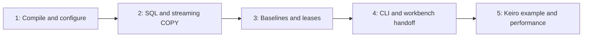

# Build Hinagata for fast PostgreSQL fixtures and isolated microservice tests

This MasterPlan is a living coordination document. Child plans own implementation milestones; keep this registry, integration ownership, and durable ADR context current.

## Vision & Scope

Hinagata will be a Haskell fixture library with a thin CLI for microservices using an already bootstrapped PostgreSQL server, especially a local Unix socket. Users can load small SQL scenarios or large streamed CSV datasets directly into their test database, or reuse a verified baseline to obtain isolated clones. Typed endpoints and application hooks allow Keiro services to consume it without adopting a particular database driver or effect system.

`docs/initial-spec.md` is the revised behavioral contract. Hurl-workbench owns service readiness, Hurl execution, and reports; Hinagata encloses the external workflow in a database lease. The first release includes deterministic fixture composition, Settei configuration, native SQL/COPY, baseline freshness, parallel isolation, retention/recovery, and a real Keiro/workbench example with measured performance. Portable dumps, capture/diff, runtime-event generation, server provisioning, and generalized orchestration are deferred.

The original working tree had no implementation or validation commands. The five plans below establish those capabilities incrementally. This initiative is linked to intention `intention_01m3g1rc9re2qa1cy17q25qfq8`, created with Mina at the user's request.

## Decomposition Strategy

Separate independently testable behaviors: pure plan compilation; direct transactional loading; managed database lifecycle; CLI/process handoff; and a complete Keiro adoption/performance example. Package setup belongs with the first useful pure behavior, and bulk COPY belongs with the transactional loader rather than a separate competing execution path. Performance probes begin in the loader and culminate in consumer benchmarks, rather than being postponed until all design decisions are frozen.

The library owns connection descriptions, fixtures, and leases; the service owns migrations and private runtime schema operations. This keeps optional ecosystem integration outside the core dependency graph. A CLI-first design would duplicate hurl-workbench's existing responsibilities. Dump/restore in every setup would add work that native same-cluster templates can avoid.

No relevant local ADR existed initially; `mori show --full` confirms there is no profiled local ADR bundle. The planning change establishes [ADR 1](../adr/1-library-boundary-and-service-owned-postgresql.md), [ADR 2](../adr/2-stream-fixtures-through-private-postgresql-sessions.md), and [ADR 3](../adr/3-sealed-baselines-and-positive-database-ownership.md) using ordinary Markdown records. Relevant external decisions consulted are `mori://shinzui/keiro/okf/adrs/concepts/ADR-9` (separate schema/ledger verification), `mori://shinzui/keiro/okf/adrs/concepts/ADR-28` (owner APIs/application hooks), and `mori://shinzui/settei/okf/adrs/concepts/ADR-2` (inspectable declarations). Unindexed workbench lifecycle/batch ADRs and exact standards/source evidence are identified through their canonical project in [the research record](../research/initial-design.md); artifact-level workbench URIs are pending.

## Exec-Plan Registry

| # | Title | Path | Hard Deps | Soft Deps | Status |
|---|-------|------|-----------|-----------|--------|
| 1 | Compile deterministic fixture plans and typed configuration | [1-compile-deterministic-fixture-plans-and-typed-configuration.md](../plans/1-compile-deterministic-fixture-plans-and-typed-configuration.md) | None | None | Not Started |
| 2 | Load SQL fixtures atomically into existing PostgreSQL databases | [2-load-sql-fixtures-atomically-into-existing-postgresql-databases.md](../plans/2-load-sql-fixtures-atomically-into-existing-postgresql-databases.md) | EP-1 | None | Not Started |
| 3 | Manage reusable baselines and isolated database leases | [3-manage-reusable-baselines-and-isolated-database-leases.md](../plans/3-manage-reusable-baselines-and-isolated-database-leases.md) | EP-2 | None | Not Started |
| 4 | Expose fixture commands and hurl-workbench handoff | [4-expose-fixture-commands-and-hurl-workbench-handoff.md](../plans/4-expose-fixture-commands-and-hurl-workbench-handoff.md) | EP-3 | None | Not Started |
| 5 | Prove Keiro service integration and performance | [5-prove-keiro-service-integration-and-performance.md](../plans/5-prove-keiro-service-integration-and-performance.md) | EP-4 | None | Not Started |

Status values are Not Started, In Progress, Complete, or Cancelled. The registry is authoritative for child status.

## Dependency Graph

The dependencies are hard because each subsequent deliverable consumes tested behavior from the previous one: the loader needs immutable plans, leases need transactional loading and native sessions, the CLI needs the lease state machine, and the final consumer proof needs the actual handoff commands. Prototype research can occur earlier but is not an independently complete child. There are no artificial parallel tracks or soft dependencies. Integration relationships exist across all consuming plans through the owned contracts below; an interface change must update the affected plan/spec/ADR before downstream work continues.

## Integration Points

The first plan owns `Hinagata.Connection`, `Hinagata.Fixture.Types`, `Hinagata.Config`, common identifiers/errors, and the bundle/fingerprint format. Later plans consume validated values. SQL/CSV manifest semantics, connection escaping, and secret representation must not be reimplemented by the CLI or example. Public type modules and the prelude do not import generic-lens orphan instances.

The second plan owns `Hinagata.Postgres.Session`, `Load`, backend errors, and the private libpq protocol/lifetime implementation. The third extends that adapter for catalog and administrative operations; it does not create another connection stack. One fixture transaction owns one exclusive connection; COPY and SQL share ordering and failure semantics. The reusable test PostgreSQL harness is owned by the second plan and extended by subsequent integration tests.

The third plan owns baseline fingerprints, `BaselineSpec`/`BaselineRef`, migration/verification/clone hooks, `LeaseInfo`, all catalog DDL/state transitions, and cleanup authority. A hook takes an endpoint and must close its connections before return. The fourth adapts CLI command specs into those hooks. The fifth supplies real application migration/verification hooks, including the complete composed runtime migration plan. Neither downstream plan writes maintenance records directly.

The fourth plan owns command grammar, JSON formatVersion 1, Settei source assembly, environment handoff, child exit mapping, and generic process-group cleanup. Library errors retain their original phase/cause. It hands connection fields to a wrapper before service startup. Workbench owns its own nested service lifecycle. If process termination cannot be established, preserve the lease with a cleanup error instead of claiming safe release.

The first plan bootstraps the environment through `mori://shinzui/seihou-modules/templates/nix-haskell-flake`. Seihou owns the generated flake, canonical lock, Nix modules, and formatter configuration; workspace customizations belong in unmanaged `flake.module.nix`. The first plan owns initial `cabal.project`, justfile, and package inventory conventions. Each package-producing plan extends these same files for its component; the fifth owns final release checks and compatibility/performance documentation. Update Mori package inventory as packages become real. The fifth owns generated benchmark cases and reference-machine budgets; native load stage reporting remains owned by the second plan, lifecycle timings by the third. Every shared file change must preserve earlier gates.

The durable boundaries are recorded in the three local ADRs: service/library ownership, private native streaming sessions, and sealed baselines with positive deletion authority. Changes to these interfaces require ADR updates in the same implementation change.

## Progress

Planning complete; 0 of 5 child plans implemented. The first child is ready to begin. The remaining children await their stated implementation prerequisites, not missing user input. All integration/performance/release gates are assigned to the fifth child, with focused correctness proofs required earlier. No benchmark result or package build is claimed by this planning change.

## Surprises & Discoveries

## Decision Log

2026-09-26: Use the `mori://shinzui/seihou-modules/templates/nix-haskell-flake` bootstrap, as requested, and keep project changes in its supported unmanaged seams.

2026-09-26: Treat sealed baselines as cluster-local reusable snapshots. A heavy fixture closure may be prepared once as a baseline variant and cloned repeatedly; portable dump snapshots remain deferred.

2026-09-26: Reuse service-owned PostgreSQL and offer direct loading alongside clones. Rationale: the user's services already bootstrap local socket databases; requiring another server would add cost and complicate ownership.

2026-09-26: Remove Hurl-specific behavior and defer dump snapshots. Rationale: workbench already owns HTTP/service execution, and same-cluster templates serve the initial repeated setup path.

2026-09-26: Include streaming CSV/COPY in the transactional loading plan. Rationale: the user explicitly confirmed both small scenarios and large bulk loads; optimizing only small SQL fixtures would miss initial scope.

2026-09-26: Keep a private libpq adapter and Hinagata-owned endpoint types. Rationale: native COPY needs explicit protocol control, and the local Hasql corpus trails a materially changed upstream API. The library should not force a runtime fleet migration.

2026-09-26: Make benchmarks release acceptance, with declared reference-machine targets rather than invented timings. Rationale: speed is a primary requirement, and cold/warm/bulk/service costs must be separately visible.

## Outcomes & Retrospective
