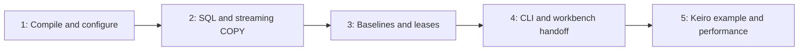

# Build Hinagata for fast PostgreSQL fixtures and isolated microservice tests

This MasterPlan is a living coordination document. Child plans own implementation milestones; keep this registry, integration ownership, and durable ADR context current.

## Vision & Scope

Hinagata will be a Haskell fixture library with a thin CLI for microservices using an already bootstrapped PostgreSQL server, especially a local Unix socket. Users can load small SQL scenarios or large streamed CSV datasets directly into their test database, or reuse a verified baseline to obtain isolated clones. Typed endpoints and application hooks allow Keiro services to consume it without adopting a particular database driver or effect system.

`docs/initial-spec.md` is the revised behavioral contract. Hurl-workbench owns service readiness, Hurl execution, and reports; Hinagata encloses the external workflow in a database lease. The first release includes deterministic fixture composition, Settei configuration, native SQL/COPY, baseline freshness, parallel isolation, retention/recovery, and a real Keiro/workbench example with measured performance. Portable dumps, capture/diff, runtime-event generation, server provisioning, and generalized orchestration are deferred.

The original working tree had no implementation or validation commands. The five plans below establish those capabilities incrementally. This initiative is linked to intention `intention_01m3g1rc9re2qa1cy17q25qfq8`, created with Mina at the user's request.

## Decomposition Strategy

Separate independently testable behaviors: pure plan compilation; direct transactional loading; managed database lifecycle; CLI/process handoff; and a complete Keiro adoption/performance example. Package setup belongs with the first useful pure behavior, and bulk COPY belongs with the transactional loader rather than a separate competing execution path. Performance probes begin in the loader and culminate in consumer benchmarks, rather than being postponed until all design decisions are frozen.

The library owns connection descriptions, fixtures, and leases; the service owns migrations and private runtime schema operations. This keeps optional ecosystem integration outside the core dependency graph. A CLI-first design would duplicate hurl-workbench's existing responsibilities. Dump/restore in every setup would add work that native same-cluster templates can avoid.

No relevant local ADR existed initially; `mori show --full` confirms there is no profiled local ADR bundle. The planning change establishes [ADR 1](../adr/1-library-boundary-and-service-owned-postgresql.md), [ADR 2](../adr/2-stream-fixtures-through-private-postgresql-sessions.md), and [ADR 3](../adr/3-sealed-baselines-and-positive-database-ownership.md) using ordinary Markdown records. Relevant external decisions consulted are `mori://shinzui/keiro/okf/adrs/concepts/ADR-9` (separate schema/ledger verification), `mori://shinzui/keiro/okf/adrs/concepts/ADR-28` (owner APIs/application hooks), and `mori://shinzui/settei/okf/adrs/concepts/ADR-2` (inspectable declarations). Unindexed workbench lifecycle/batch ADRs and exact standards/source evidence are identified through their canonical project in [the research record](../research/initial-design.md); artifact-level workbench URIs are pending.

## Exec-Plan Registry

| # | Title | Path | Hard Deps | Soft Deps | Status |
|---|-------|------|-----------|-----------|--------|
| 1 | Compile deterministic fixture plans and typed configuration | [1-compile-deterministic-fixture-plans-and-typed-configuration.md](../plans/1-compile-deterministic-fixture-plans-and-typed-configuration.md) | None | None | Complete |
| 2 | Load SQL fixtures atomically into existing PostgreSQL databases | [2-load-sql-fixtures-atomically-into-existing-postgresql-databases.md](../plans/2-load-sql-fixtures-atomically-into-existing-postgresql-databases.md) | EP-1 | None | Complete |
| 3 | Manage reusable baselines and isolated database leases | [3-manage-reusable-baselines-and-isolated-database-leases.md](../plans/3-manage-reusable-baselines-and-isolated-database-leases.md) | EP-2 | None | In Progress |
| 4 | Expose fixture commands and hurl-workbench handoff | [4-expose-fixture-commands-and-hurl-workbench-handoff.md](../plans/4-expose-fixture-commands-and-hurl-workbench-handoff.md) | EP-3 | None | Not Started |
| 5 | Prove Keiro service integration and performance | [5-prove-keiro-service-integration-and-performance.md](../plans/5-prove-keiro-service-integration-and-performance.md) | EP-4 | None | Not Started |

Status values are Not Started, In Progress, Complete, or Cancelled. The registry is authoritative for child status.

## Dependency Graph

The dependencies are hard because each subsequent deliverable consumes tested behavior from the previous one: the loader needs immutable plans, leases need transactional loading and native sessions, the CLI needs the lease state machine, and the final consumer proof needs the actual handoff commands. Prototype research can occur earlier but is not an independently complete child. There are no artificial parallel tracks or soft dependencies. Integration relationships exist across all consuming plans through the owned contracts below; an interface change must update the affected plan/spec/ADR before downstream work continues.

## Integration Points

The first plan owns `Hinagata.Connection`, `Hinagata.Fixture.Types`, `Hinagata.Config`, common identifiers/errors, and the bundle/fingerprint format. Later plans consume validated values. SQL/CSV manifest semantics, connection escaping, and secret representation must not be reimplemented by the CLI or example. Public type modules and the prelude do not import generic-lens orphan instances.

The second plan owns `Hinagata.Postgres.Session`, `Load`, backend errors, and the private libpq protocol/lifetime implementation. The third extends that adapter for catalog and administrative operations; it does not create another connection stack. One fixture transaction owns one exclusive connection; COPY and SQL share ordering and failure semantics. The reusable test PostgreSQL harness is owned by the second plan and extended by subsequent integration tests.

The first plan also owns per-fixture identities and pure base/scenario composition. The lifecycle layer alone authorizes skipping the verified base prefix on a fresh clone.

The third plan owns the suite-scoped manager, bounded admission, callback-result classification, explainable preparation reports, baseline fingerprints, `BaselineSpec`/`BaselineRef`, migration/verification/clone hooks, `LeaseInfo`, all catalog DDL/state transitions, and cleanup authority. A hook takes an endpoint and must close its connections before return. The fourth adapts CLI command specs into those hooks and emits their reports; it passes application access to child processes. Administration/setup/application access descriptions and their Settei declarations originate in the first plan. The fifth proves role behavior and accounts for manager plus application connections. The fifth supplies real application migration/verification hooks, including the complete composed runtime migration plan. Neither downstream plan writes maintenance records directly. The locking protocol is fixed here because the fifth plan measures it: clone allocation takes a baseline generation's advisory lock in shared mode, while build, retirement, and cleanup take it exclusively, so concurrent clones of one template overlap as PostgreSQL permits. The administration role owns every Hinagata-created database, and the third plan applies declared grants and settings to a fresh generation before the migration hook as well as to each clone. Cleanup treats a held session lock as the only proof that a lease is live and classifies a record whose lock is free as orphaned.

The fourth plan owns command grammar, JSON formatVersion 1, Settei source assembly, environment handoff, child exit mapping, and generic process-group cleanup. The child environment overlay is exactly `PGHOST`, `PGPORT`, `PGUSER`, `PGDATABASE`, `HINAGATA_RUN_ID`, and `HINAGATA_LEASE_ID`; a password travels only through a private `PGPASSFILE`. Library errors retain their original phase/cause. It hands connection fields to a wrapper before service startup. Workbench owns its own nested service lifecycle. If process termination cannot be established, preserve the lease with a cleanup error instead of claiming safe release.

The first plan bootstraps the environment through `mori://shinzui/seihou-modules/templates/nix-haskell-flake`. Seihou owns the generated flake, canonical lock, Nix modules, and formatter configuration; workspace customizations belong in unmanaged `flake.module.nix`. The first plan owns initial `cabal.project`, justfile, and package inventory conventions. Each package-producing plan extends these same files for its component; the fifth owns final release checks and compatibility/performance documentation. Update Mori package inventory as packages become real. The fifth owns generated benchmark cases and reference-machine budgets; native load stage reporting remains owned by the second plan, lifecycle timings by the third. The second plan's first load benchmark is a `hinagata-postgres` benchmark component that the fifth plan's `bench/` driver aggregates. The clone strategy is a first-plan configuration value defaulting to `WAL_LOG`, applied by the third plan and measured by the fifth. Every shared file change must preserve earlier gates.

The durable boundaries are recorded in the three local ADRs: service/library ownership, private native streaming sessions, and sealed baselines with positive deletion authority. Changes to these interfaces require ADR updates in the same implementation change.

The [Haskell standards audit](../research/haskell-standards-audit.md) owns the applicability map. EP-1 establishes complete component baseline coverage, prelude/record conventions, and `just check-conventions`; all children extend that gate. EP-4 owns selected CLI help/completion/version patterns and example Hurl contract checks; EP-5 verifies release distributions and real-service acceptance. Hurl remains an external example/CI tool, and Settei supersedes legacy configuration patterns.

## Progress

Planning complete and architecture-reviewed on 2026-09-30, with the review's shared-contract refinements applied. EP-1 is complete: Seihou's `nix-haskell-flake` bootstrapped the development environment, and the core package passes its tests, source-distribution, formatter, Nix package and flake checks, and the CSV capture residency probe. EP-2 is complete: the private libpq loader passes socket-only and TCP integration suites, source distribution, Haddock, local Nix checks, and a 100k/1m-row bounded-residency benchmark. EP-3 is in progress on baseline and lease lifecycle. 2 of 5 child plans are complete. Full service integration/performance/release gates remain assigned to the fifth child, with focused correctness proofs required earlier.

## Surprises & Discoveries

The [prior-art review](../research/prior-art.md) supports prepared templates and per-test clones. It exposed an underspecified base/scenario overlap: shared fixtures must be compared by captured identity and excluded only from a verified baseline prefix. A result returned as a value can also represent test failure, requiring explicit classification for preservation.

The 2026-09-30 architecture review verified two PostgreSQL facts that shape the lifecycle contract. CREATE DATABASE takes only a share lock on its template (`src/backend/commands/dbcommands.c`: "ShareLock allows two CREATE DATABASEs to work from the same template concurrently"), so an exclusive Hinagata allocation lock would have been the concurrency bottleneck the fifth plan measures. PostgreSQL 15 removed CREATE on `public` for roles other than the database owner, so a setup role distinct from the owning administration role cannot migrate a fresh generation unless declared grants are applied first.

EP-1's 2026-10-01 memory probe caught lazy SHA256 context accumulation despite bounded reads; strict updates hold roughly constant GHC heap residency for 8 MiB and 80 MiB CSV captures. PostgreSQL's database-level `CREATE` privilege does not provide `CREATE ON SCHEMA public`, so the shared Settei contract now declares schema grants separately and [ADR 3](../adr/3-sealed-baselines-and-positive-database-ownership.md) records the distinction. EP-3 must apply the declared schema grants before migration on a fresh generation and assert them on clones.

## Decision Log

2026-09-30: Architecture review by claude-fable-5-1 confirmed the five-child decomposition, ownership boundaries, and linear hard dependencies; no child is split, merged, or reordered. Three shared-contract refinements are applied across the spec, ADR 3, and the children: shared-mode allocation locking so Hinagata never serializes concurrent clones, fresh-generation preparation of declared grants and settings before the migration hook, and orphaned-lease classification by a free session lock. Smaller reconciliations: the child environment overlay variables, the home of the second plan's benchmark, the clone strategy as a measured setting, and the already existing README.

2026-09-30: Keep whole-child hard dependencies even though the fourth plan's offline fixture CLI needs only the first two children. Rationale: one implementer works the chain sequentially, and a milestone-level dependency would be introduced explicitly per MASTERPLAN.md if parallel contributors become available, not by silently weakening the registry.

2026-09-26: Audit haskell-jitsurei beyond the three initial core citations. Make inherited Cabal settings, optic/prelude rules, serialization policy, multiline literals, selected CLI patterns, and example Hurl assertions explicit. Distinguish universal core standards from optional patterns; no new subsystem or child plan is needed.

2026-09-26: Incorporate the source review through the existing five plans: reusable prepared handles, exact base/scenario composition, bounded cancellable admission, explainable reuse, realistic application roles, and failure-result classification. EP-1 owns pure identities/configuration; EP-3 owns lifecycle/report semantics; EP-4 presents them; EP-5 verifies consumer behavior and performance. Keep spare clones as an evidence-triggered experiment, with no new daemon or public pool in initial scope.

2026-09-26: Use the `mori://shinzui/seihou-modules/templates/nix-haskell-flake` bootstrap, as requested, and keep project changes in its supported unmanaged seams.

2026-09-26: Treat sealed baselines as cluster-local reusable snapshots. A heavy fixture closure may be prepared once as a baseline variant and cloned repeatedly; portable dump snapshots remain deferred.

2026-09-26: Reuse service-owned PostgreSQL and offer direct loading alongside clones. Rationale: the user's services already bootstrap local socket databases; requiring another server would add cost and complicate ownership.

2026-09-26: Remove Hurl-specific behavior and defer dump snapshots. Rationale: workbench already owns HTTP/service execution, and same-cluster templates serve the initial repeated setup path.

2026-09-26: Include streaming CSV/COPY in the transactional loading plan. Rationale: the user explicitly confirmed both small scenarios and large bulk loads; optimizing only small SQL fixtures would miss initial scope.

2026-09-26: Keep a private libpq adapter and Hinagata-owned endpoint types. Rationale: native COPY needs explicit protocol control, and the local Hasql corpus trails a materially changed upstream API. The library should not force a runtime fleet migration.

2026-09-26: Make benchmarks release acceptance, with declared reference-machine targets rather than invented timings. Rationale: speed is a primary requirement, and cold/warm/bulk/service costs must be separately visible.

## Outcomes & Retrospective

Revision note (2026-09-26): Prior-art research tightens shared contracts and acceptance across the five existing children. Their dependency order and Not Started status are unchanged; no upstream timing is treated as measured Hinagata performance.

Revision note (2026-09-26): Standards applicability audit closes planning omissions and assigns conventions, CLI tooling, and HTTP-example checks to existing children. Implementation compliance remains unverified until those gates run.

Revision note (2026-09-30): Architecture review applied shared-contract refinements (lock modes, generation preparation, orphan classification, environment overlay, benchmark home, clone strategy) to the spec, ADR 3, and children 1 through 5. Decomposition, dependency order, and Not Started status are unchanged.
